# Hospital Management System - Entity Relationship Diagram

## Core ER Diagram

```mermaid
erDiagram
    %% User Management
    USERS {
        bigint id PK
        string username UK
        string email UK
        string password_hash
        string first_name
        string last_name
        string phone
        datetime created_at
        datetime updated_at
        boolean is_active
        string created_by
    }
    
    ROLES {
        bigint id PK
        string name UK
        string description
        datetime created_at
        boolean is_active
    }
    
    PERMISSIONS {
        bigint id PK
        string name UK
        string description
        string module
        string action
        datetime created_at
    }
    
    ROLE_PERMISSIONS {
        bigint role_id PK,FK
        bigint permission_id PK,FK
        datetime granted_at
        string granted_by
    }
    
    USER_ROLES {
        bigint user_id PK,FK
        bigint role_id PK,FK
        bigint branch_id FK
        datetime assigned_at
        string assigned_by
        datetime expires_at
    }
    
    %% Branch Management
    BRANCHES {
        bigint id PK
        string name
        string code UK
        string type
        string address
        string city
        string region
        string phone
        string email
        boolean is_active
        datetime created_at
        bigint capacity
        string license_number
    }
    
    %% Patient Management
    PATIENTS {
        bigint id PK
        string patient_id UK
        string first_name
        string last_name
        date date_of_birth
        string gender
        string phone
        string email
        string address
        string city
        string emergency_contact_name
        string emergency_contact_phone
        string blood_group
        string allergies
        string chronic_conditions
        string insurance_provider
        string insurance_policy_number
        datetime created_at
        datetime updated_at
        bigint created_by
        boolean is_active
    }
    
    PATIENT_VISITS {
        bigint id PK
        bigint patient_id FK
        bigint branch_id FK
        datetime visit_date
        string visit_type
        string chief_complaint
        string symptoms
        string vital_signs
        string triage_level
        string status
        datetime created_at
        bigint created_by
    }
    
    %% Clinical Management
    CONSULTATIONS {
        bigint id PK
        string consultation_id UK
        bigint patient_id FK
        bigint visit_id FK
        bigint doctor_id FK
        bigint branch_id FK
        datetime consultation_date
        string consultation_type
        string chief_complaint
        string history_present_illness
        string physical_examination
        string diagnosis
        string treatment_plan
        string notes
        string status
        datetime created_at
        bigint created_by
        datetime updated_at
    }
    
    DIAGNOSES {
        bigint id PK
        bigint consultation_id FK
        string icd10_code
        string diagnosis_name
        string diagnosis_type
        string severity
        string notes
        datetime diagnosed_at
        bigint diagnosed_by
    }
    
    PRESCRIPTIONS {
        bigint id PK
        string prescription_id UK
        bigint consultation_id FK
        bigint patient_id FK
        bigint doctor_id FK
        bigint branch_id FK
        datetime prescription_date
        string status
        string notes
        datetime created_at
        bigint created_by
    }
    
    PRESCRIPTION_ITEMS {
        bigint id PK
        bigint prescription_id FK
        bigint medication_id FK
        string dosage
        string frequency
        string duration
        string instructions
        integer quantity
        string status
        datetime created_at
    }
    
    %% Laboratory Management
    LAB_TESTS {
        bigint id PK
        string test_id UK
        bigint patient_id FK
        bigint consultation_id FK
        bigint branch_id FK
        bigint doctor_id FK
        string test_type
        string test_name
        string specimen_type
        string urgency_level
        string status
        datetime ordered_at
        datetime specimen_collected_at
        datetime result_available_at
        bigint ordered_by
        bigint performed_by
    }
    
    LAB_RESULTS {
        bigint id PK
        bigint lab_test_id FK
        string result_value
        string reference_range
        string unit
        string status
        string interpretation
        datetime tested_at
        bigint tested_by
        datetime verified_at
        bigint verified_by
    }
    
    %% Pharmacy Management
    MEDICATIONS {
        bigint id PK
        string medication_code UK
        string generic_name
        string brand_name
        string dosage_form
        string strength
        string manufacturer
        string category
        string description
        boolean is_controlled
        boolean is_active
        datetime created_at
    }
    
    PHARMACY_INVENTORY {
        bigint id PK
        bigint branch_id FK
        bigint medication_id FK
        integer current_stock
        integer minimum_stock
        integer maximum_stock
        string batch_number
        date expiry_date
        decimal unit_cost
        decimal selling_price
        string supplier
        datetime last_updated
        bigint updated_by
    }
    
    PHARMACY_DISPENSING {
        bigint id PK
        bigint prescription_id FK
        bigint medication_id FK
        bigint branch_id FK
        integer quantity_dispensed
        decimal amount_charged
        string dispensed_by
        datetime dispensed_at
        string status
    }
    
    %% Ward Management
    WARDS {
        bigint id PK
        bigint branch_id FK
        string ward_name
        string ward_type
        integer total_beds
        integer available_beds
        string charge_per_day
        boolean is_active
        datetime created_at
    }
    
    BEDS {
        bigint id PK
        bigint ward_id FK
        string bed_number
        string bed_type
        string status
        datetime last_maintenance
        bigint patient_id FK
        datetime occupied_at
    }
    
    ADMISSIONS {
        bigint id PK
        string admission_id UK
        bigint patient_id FK
        bigint branch_id FK
        bigint ward_id FK
        bigint bed_id FK
        bigint doctor_id FK
        datetime admission_date
        datetime discharge_date
        string admission_type
        string diagnosis
        string status
        decimal deposit_amount
        datetime created_at
        bigint created_by
    }
    
    %% Billing Management
    INVOICES {
        bigint id PK
        string invoice_number UK
        bigint patient_id FK
        bigint branch_id FK
        bigint consultation_id FK
        bigint admission_id FK
        datetime invoice_date
        datetime due_date
        decimal total_amount
        decimal discount_amount
        decimal tax_amount
        decimal net_amount
        string status
        string payment_method
        datetime created_at
        bigint created_by
    }
    
    INVOICE_ITEMS {
        bigint id PK
        bigint invoice_id FK
        string item_type
        string description
        integer quantity
        decimal unit_price
        decimal total_price
        string reference_id
    }
    
    PAYMENTS {
        bigint id PK
        string payment_id UK
        bigint invoice_id FK
        bigint patient_id FK
        bigint branch_id FK
        decimal amount
        string payment_method
        string transaction_reference
        string status
        datetime payment_date
        datetime created_at
        bigint created_by
    }
    
    %% Inventory Management
    SUPPLIERS {
        bigint id PK
        string supplier_name
        string contact_person
        string phone
        string email
        string address
        string payment_terms
        boolean is_active
        datetime created_at
    }
    
    PURCHASE_ORDERS {
        bigint id PK
        string order_number UK
        bigint branch_id FK
        bigint supplier_id FK
        datetime order_date
        datetime expected_delivery_date
        string status
        decimal total_amount
        datetime created_at
        bigint created_by
    }
    
    PURCHASE_ORDER_ITEMS {
        bigint id PK
        bigint purchase_order_id FK
        bigint medication_id FK
        integer quantity
        decimal unit_price
        decimal total_price
        string batch_number
        date expiry_date
    }
    
    %% Audit and Logs
    USER_ACTIVITY_LOG {
        bigint id PK
        bigint user_id FK
        bigint branch_id FK
        string action
        string module
        string details
        string ip_address
        string user_agent
        datetime created_at
    }
    
    USER_SESSIONS {
        bigint id PK
        bigint user_id FK
        string session_token
        string ip_address
        string user_agent
        datetime created_at
        datetime expires_at
        datetime last_activity
        boolean is_active
    }
    
    %% Relationships
    USERS ||--o{ USER_ROLES : "has"
    ROLES ||--o{ USER_ROLES : "assigned"
    ROLES ||--o{ ROLE_PERMISSIONS : "has"
    PERMISSIONS ||--o{ ROLE_PERMISSIONS : "granted"
    BRANCHES ||--o{ USER_ROLES : "at"
    
    BRANCHES ||--o{ PATIENT_VISITS : "receives"
    PATIENTS ||--o{ PATIENT_VISITS : "visits"
    PATIENT_VISITS ||--o{ CONSULTATIONS : "leads to"
    PATIENTS ||--o{ CONSULTATIONS : "has"
    
    USERS ||--o{ CONSULTATIONS : "conducts"
    BRANCHES ||--o{ CONSULTATIONS : "at"
    CONSULTATIONS ||--o{ DIAGNOSES : "results in"
    CONSULTATIONS ||--o{ PRESCRIPTIONS : "generates"
    
    PRESCRIPTIONS ||--o{ PRESCRIPTION_ITEMS : "contains"
    MEDICATIONS ||--o{ PRESCRIPTION_ITEMS : "prescribed"
    
    CONSULTATIONS ||--o{ LAB_TESTS : "orders"
    PATIENTS ||--o{ LAB_TESTS : "tested"
    LAB_TESTS ||--o{ LAB_RESULTS : "produces"
    
    BRANCHES ||--o{ PHARMACY_INVENTORY : "stocks"
    MEDICATIONS ||--o{ PHARMACY_INVENTORY : "inventoried"
    PRESCRIPTION_ITEMS ||--o{ PHARMACY_DISPENSING : "dispensed"
    
    BRANCHES ||--o{ WARDS : "has"
    WARDS ||--o{ BEDS : "contains"
    BEDS ||--o{ ADMISSIONS : "occupied by"
    PATIENTS ||--o{ ADMISSIONS : "admitted"
    
    PATIENTS ||--o{ INVOICES : "billed"
    BRANCHES ||--o{ INVOICES : "at"
    INVOICES ||--o{ INVOICE_ITEMS : "contains"
    INVOICES ||--o{ PAYMENTS : "paid via"
    
    SUPPLIERS ||--o{ PURCHASE_ORDERS : "supplies"
    BRANCHES ||--o{ PURCHASE_ORDERS : "orders"
    PURCHASE_ORDERS ||--o{ PURCHASE_ORDER_ITEMS : "contains"
    MEDICATIONS ||--o{ PURCHASE_ORDER_ITEMS : "ordered"
    
    USERS ||--o{ USER_ACTIVITY_LOG : "performs"
    USERS ||--o{ USER_SESSIONS : "has"
```

## Database Schema Relationships Summary

### Primary Entities:
1. **Users & Authentication**: Users, Roles, Permissions, Role_Permissions, User_Roles
2. **Branch Management**: Branches with multi-branch support
3. **Patient Management**: Patients, Patient_Visits
4. **Clinical Operations**: Consultations, Diagnoses, Prescriptions, Prescription_Items
5. **Laboratory**: Lab_Tests, Lab_Results
6. **Pharmacy**: Medications, Pharmacy_Inventory, Pharmacy_Dispensing
7. **Ward Management**: Wards, Beds, Admissions
8. **Billing**: Invoices, Invoice_Items, Payments
9. **Inventory**: Suppliers, Purchase_Orders, Purchase_Order_Items
10. **Audit**: User_Activity_Log, User_Sessions

### Key Relationships:
- **Many-to-Many**: Users ↔ Roles via User_Roles
- **One-to-Many**: Branches → Patients, Consultations, Invoices
- **Hierarchical**: Consultations → Diagnoses → Prescriptions
- **Transaction Flow**: Consultations → Lab_Tests → Lab_Results
- **Supply Chain**: Suppliers → Purchase_Orders → Pharmacy_Inventory

### Foreign Key Constraints:
- All branch-specific tables reference `branches.id`
- Patient-related tables reference `patients.id`
- User actions reference `users.id`
- Financial transactions reference appropriate parent records

### Indexes for Performance:
- Unique constraints on IDs (patient_id, consultation_id, etc.)
- Composite indexes on frequently queried combinations
- Foreign key indexes for join operations

This ER diagram supports the complete hospital workflow including multi-branch operations, comprehensive patient care pathways, and full audit trails for compliance.
