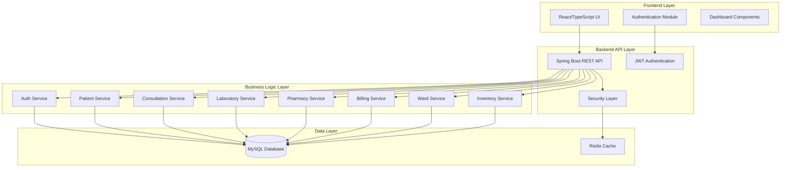
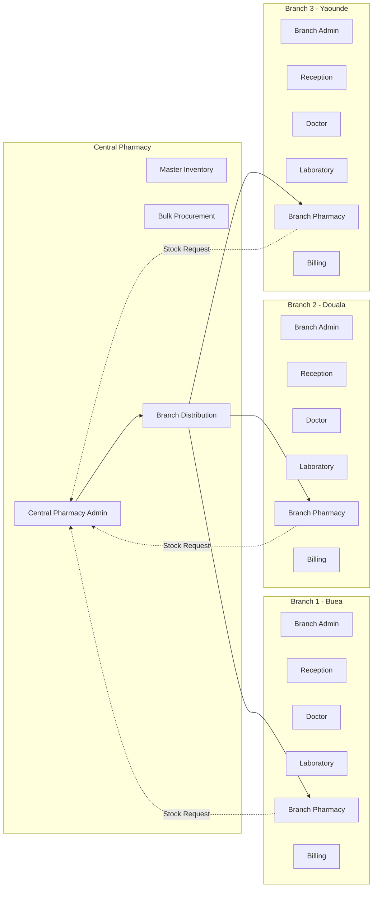
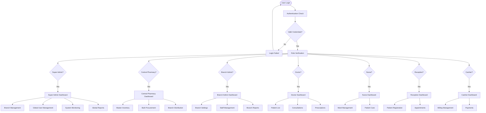
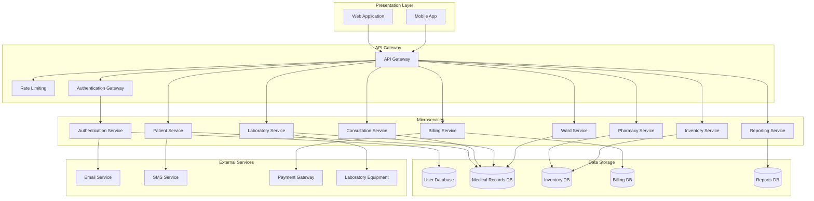
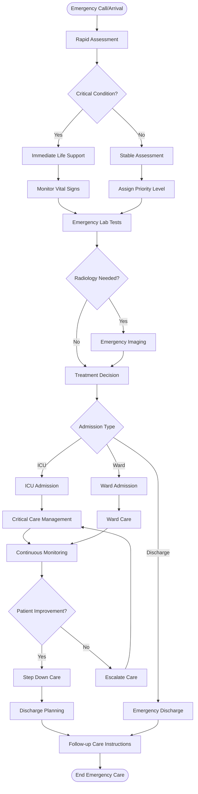

# General Medicine Hospital Workflow - Corrected Flow Chart

## System Architecture Overview

## Patient Journey Workflow

```mermaid
flowchart TD
    START([Patient Arrival]) --> REGISTRATION
    REGISTRATION[Patient Registration] --> VERIFY_ID
    VERIFY_ID{Verify Identity} -->|New Patient| CREATE_RECORD
    VERIFY_ID{Verify Identity} -->|Existing Patient| RETRIEVE_RECORD
    
    CREATE_RECORD[Create Medical Record] --> ASSIGN_ID
    ASSIGN_ID[Assign Patient ID] --> TRIAGE
    
    RETRIEVE_RECORD[Retrieve Existing Record] --> UPDATE_INFO
    UPDATE_INFO[Update Information] --> TRIAGE
    
    TRIAGE[Triage Assessment] --> URGENCY{Urgency Level}
    URGENCY -->|Emergency| EMERGENCY_CARE
    URGENCY -->|Urgent| URGENT_CONSULT
    URGENCY -->|Routine| ROUTINE_CONSULT
    
    EMERGENCY_CARE[Emergency Care] --> STABILIZE
    STABILIZE[Stabilize Patient] --> ADMISSION
    
    URGENT_CONSULT[Urgent Consultation] --> DOCTOR_ASSIGN
    ROUTINE_CONSULT[Routine Consultation] --> DOCTOR_ASSIGN
    
    DOCTOR_ASSIGN[Assign Doctor] --> CONSULTATION
    CONSULTATION[Medical Consultation] --> DIAGNOSIS
    
    DIAGNOSIS[Diagnosis] --> TREATMENT_PLAN
    TREATMENT_PLAN[Treatment Plan] --> LAB_TESTS{Lab Tests Required?}
    
    LAB_TESTS -->|Yes| LAB_ORDER
    LAB_TESTS -->|No| PRESCRIPTION{Prescription Required?}
    
    LAB_ORDER[Laboratory Tests] --> SAMPLE_COLLECTION
    SAMPLE_COLLECTION[Sample Collection] --> LAB_ANALYSIS
    LAB_ANALYSIS[Laboratory Analysis] --> RESULTS
    RESULTS[Lab Results] --> DOCTOR_REVIEW
    DOCTOR_REVIEW[Doctor Review] --> PRESCRIPTION
    
    PRESCRIPTION{Prescription Required?} -->|Yes| PHARMACY
    PRESCRIPTION -->|No| FOLLOW_UP{Follow-up Required?}
    
    PHARMACY[Pharmacy Dispensing] --> MEDICATION
    MEDICATION[Medication Administration] --> FOLLOW_UP
    
    FOLLOW_UP{Follow-up Required?} -->|Yes| SCHEDULE_FOLLOWUP
    FOLLOW_UP -->|No| BILLING
    
    SCHEDULE_FOLLOWUP[Schedule Follow-up] --> BILLING
    
    BILLING[Billing Process] --> PAYMENT
    PAYMENT[Payment Collection] --> DISCHARGE
    
    ADMISSION[Admission Process] --> WARD_ASSIGN
    WARD_ASSIGN[Ward Assignment] --> INPATIENT_CARE
    INPATIENT_CARE[Inpatient Care] --> TREATMENT
    TREATMENT[Ongoing Treatment] --> DISCHARGE_PLANNING
    DISCHARGE_PLANNING[Discharge Planning] --> BILLING
    
    DISCHARGE[Patient Discharge] --> END([End of Journey])
```

## Multi-Branch Workflow

## User Role & Permission Flow

## Data Flow Architecture

## Emergency Response Workflow

## Key Corrections Made:

1. **Clear Patient Journey Flow**: Added comprehensive patient flow from arrival to discharge
2. **Multi-Branch Integration**: Properly connected central pharmacy with branch operations
3. **Role-Based Access**: Detailed user role and permission workflow
4. **Data Architecture**: Clear separation of concerns across different databases
5. **Emergency Response**: Dedicated emergency care workflow
6. **System Integration**: Proper API gateway and microservices architecture

## System Modules Identified:

- **Authentication & Authorization**: JWT-based security
- **Patient Management**: Registration, records, history
- **Clinical Operations**: Consultations, diagnoses, treatments
- **Laboratory Services**: Tests, results, analysis
- **Pharmacy Management**: Central and branch pharmacy operations
- **Billing & Payments**: Invoicing, insurance, cash collection
- **Ward Management**: Inpatient care, bed management
- **Inventory Management**: Stock control, procurement
- **Reporting & Analytics**: Clinical and financial reports
- **Multi-Branch Support**: Centralized coordination with branch autonomy

This corrected flow chart provides a comprehensive view of the General Medicine Hospital Workflow system with proper integration between all modules and clear patient care pathways.
